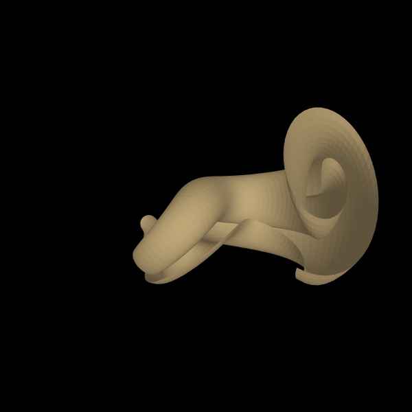
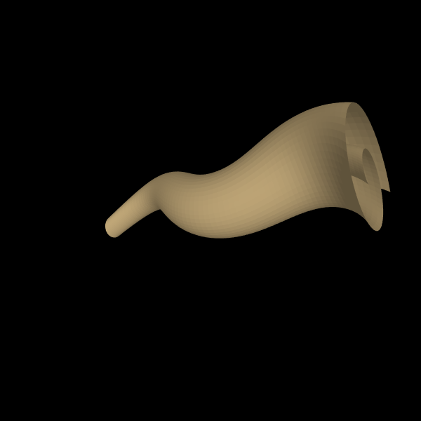
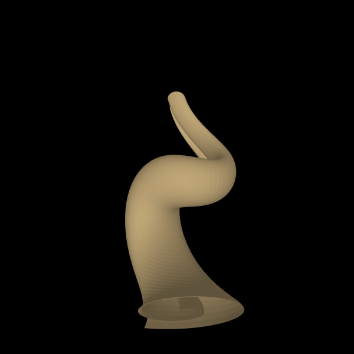

# Cornucopia

* Author: Lorenzo Pasqualis
* Blog: [https://www.coderhood.com](https://www.coderhood.com)
* Twitter: [@lpasqualis](http://www.twitter.com/lpasqualis)

License: MIT

# Abstract
Processing 3 sketch to create doodles of Cornucopia shapes inspired by my [paper and ink doodles](https://www.coderhood.com/doodle-tuesday-tangle-scrolls/).

